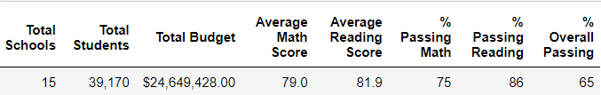
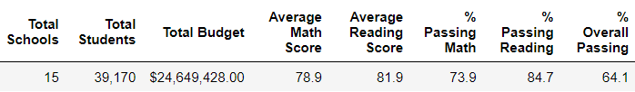
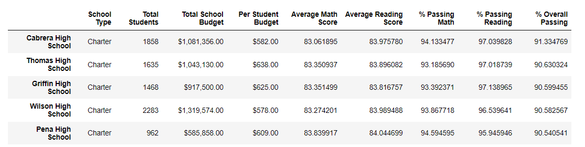
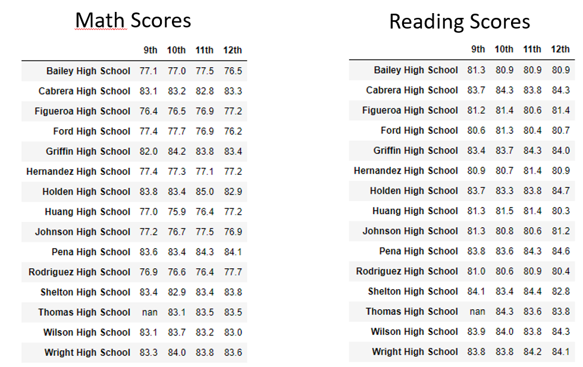
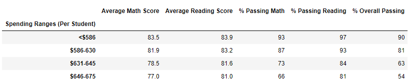
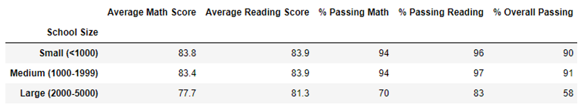
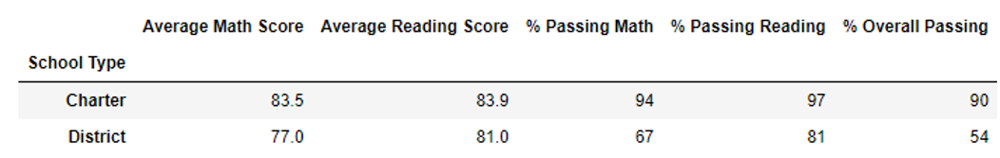

# School_District_Analysis

## Overview of the school district analysis:
In this project we helped the School Board to analyze data on student funding and students' standarized test scores. This analysis will assist in making decisions regarding the school budgets and priorities. 

The school board has notified that the students_complete.csv file shows evidence of academic dishonesty; specifically, reading and math grades for Thomas High School ninth graders appear to have been altered. So the school board want to uphold state-testing standards and have turned to us for help. We've been asked to replace the math and reading scores for Thomas High School while keeping the rest of the data intact. Once we’ve replaced the math and reading scores, we repeated the school district analysis that we did the first time and write up a report to describe how these changes affected the overall analysis.

## Results: 

* How is the district summary affected?

The following images reflects how the District Summary changed and we can observe that the district's metrics went down on Average Math Score, % Passing Math and %Overal Passing.

Before replacing math scores from Thomas High School 9th graders.

After replacing math scores from Thomas High School 9th graders.

* How is the school summary affected?

After replacing the 9th graders math scores, the school summary places TSH  2nd place in the school summary. 

*  How does replacing the ninth-grade scores affect the following:

1.  Math and reading scores by grade

2.  Scores by school spending

3.  Scores by school size

4.  Scores by school type

## Summary: Summarize four changes in the updated school district analysis after reading and math scores for the ninth grade at Thomas High School have been replaced with NaNs.